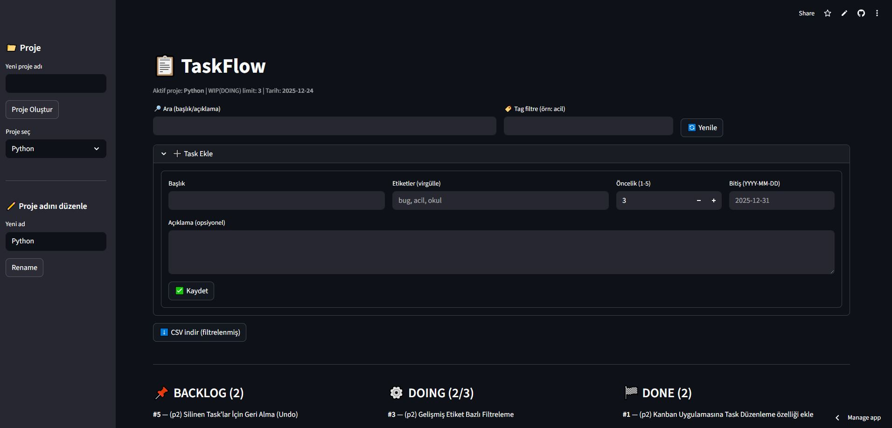
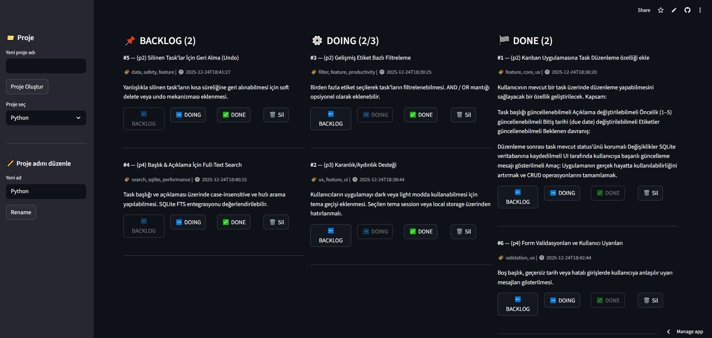
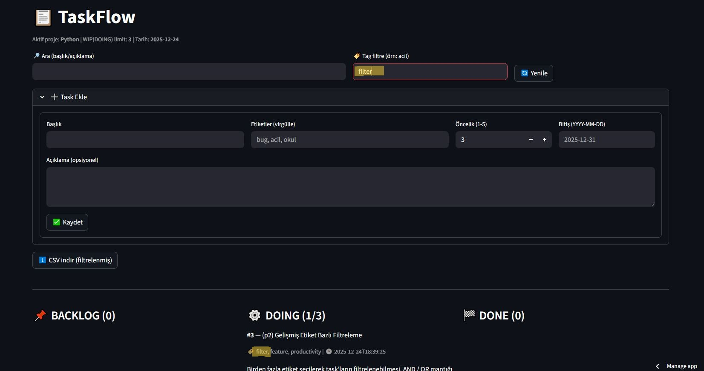
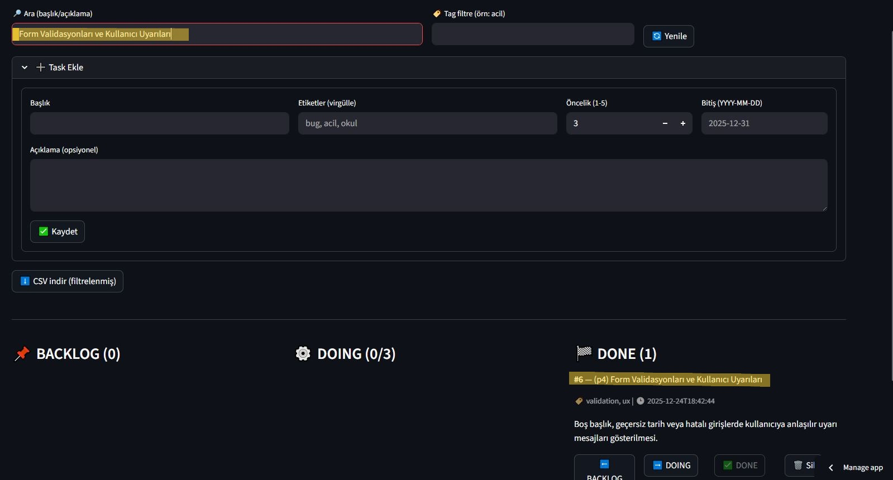

# 🗂️ TaskFlow <sub>Web Kanban Uygulaması</sub>


_Streamlit ve SQLite ile geliştirilmiş hafif, sade ve paylaşılabilir görev yönetim uygulaması_

## 🧠 Proje Açıklaması

**TaskFlow**, bireysel veya küçük ekiplerin günlük iş ve görevlerini düzenli bir şekilde takip edebilmesi için geliştirilmiş,
**web tabanlı bir Kanban yönetim uygulamasıdır**.

Uygulamanın temel amacı; yapılacak işleri görünür hale getirmek, önceliklendirmek ve
iş akışını sade ama etkili bir yapı üzerinden yönetmektir.
Bu sayede kullanıcılar hem ne üzerinde çalıştıklarını hem de sırada ne olduğunu kolayca takip edebilir.

---

## 🧩 Nasıl Çalışır?

TaskFlow, klasik Kanban metodolojisini temel alır ve görevleri üç ana aşamada ele alır:

- **Backlog**  
  Henüz başlanmamış, yapılması planlanan görevler

- **Doing**  
  Üzerinde aktif olarak çalışılan görevler

- **Done**  
  Tamamlanmış görevler

Kullanıcılar görevleri bu aşamalar arasında taşıyarak iş akışını görsel olarak yönetir.

---

## ✨ Temel Özellikler

### 📌 Görev Yönetimi (CRUD)
- Yeni görev eklenebilir
- Mevcut görevler düzenlenebilir
- Görevler silinebilir
- Görevler Backlog / Doing / Done durumları arasında taşınabilir

---

### 🔢 Öncelik Seviyesi
Her görev için **1 ile 5 arasında** bir öncelik seviyesi belirlenebilir.
Bu sayede acil veya önemli işler kolayca ayırt edilir.

---

### 📅 Bitiş Tarihi (Due Date)
Görevlere bitiş tarihi atanabilir.
Bu özellik, zaman yönetimini güçlendirir ve gecikme riskini azaltır.

---

### 🏷️ Etiket Sistemi
Görevler etiketlenebilir (örneğin: `bug`, `feature`, `ux`, `acil`).
Etiketler sayesinde görevler kategorilere ayrılır ve filtrelenebilir.

---

### 🔍 Arama ve Filtreleme
- Görev başlığı ve açıklaması üzerinden arama yapılabilir
- Etiketlere göre filtreleme uygulanabilir
- Büyük görev listelerinde hızlı erişim sağlanır

---

### 🎯 WIP (Work In Progress) Limiti
Doing kolonunda aynı anda bulunabilecek maksimum görev sayısı sınırlandırılabilir.
Bu özellik, odaklanmayı artırmayı ve iş yükünü dengede tutmayı amaçlar.

---

### 💾 Kalıcı Veri Saklama
Tüm görevler **SQLite veritabanında** saklanır.
Sayfa yenilense veya uygulama kapatılsa bile veriler kaybolmaz.

---

### 📤 Veri Dışa Aktarma
Filtrelenmiş veya tüm görevler **CSV formatında** dışa aktarılabilir.
Bu sayede görevler raporlama veya analiz amaçlı kullanılabilir.

---

### 📝 Proje Yönetimi
- Proje adı sidebar üzerinden yeniden adlandırılabilir
- Uygulama, tek bir proje etrafında sade bir yapı sunar
- Demo ve portföy kullanımı için idealdir

---

### 🌐 Web Üzerinden Paylaşılabilir Yapı
Uygulama **Streamlit Community Cloud** üzerinde deploy edilmiştir.
Linke sahip olan herkes uygulamayı görüntüleyebilir ve etkileşime girebilir.
Herhangi bir giriş veya kurulum gerekmez.

---
## 🖥️ Uygulama Arayüzü

### 📌 Kanban Board Genel Görünüm
Backlog, Doing ve Done kolonlarından oluşan ana Kanban ekranı.  
Görevler durumlarına göre kolayca yönetilebilir ve taşınabilir.



---

### ➕ Görev Ekleme ve Düzenleme
Kullanıcılar başlık, açıklama, etiket, öncelik ve bitiş tarihi bilgileriyle yeni görevler ekleyebilir.  
Mevcut görevler güncellenebilir veya silinebilir.



---

### 🔍 Arama, Filtreleme ve CSV Dışa Aktarma
Başlık ve açıklama üzerinden arama yapılabilir, etiketlere göre filtreleme uygulanabilir.  
Filtrelenmiş görevler CSV formatında dışa aktarılabilir.

<p align="center">
  
</p>

<p align="center">
  
</p>

---


## 🔐 Demo Ortamı Hakkında

TaskFlow şu anda **paylaşımlı bir demo ortamı** olarak çalışmaktadır.
Bu nedenle:
- Tüm kullanıcılar aynı görevleri görür
- Yapılan değişiklikler herkes için geçerlidir

Bu yapı, uygulamanın gerçek kullanım senaryosunu göstermek amacıyla bilinçli olarak tercih edilmiştir.

---

## 🎯 Kimler İçin Uygun?

- Günlük görevlerini düzenlemek isteyen bireyler
- Kanban metodolojisini öğrenmek isteyenler
- Python & Streamlit tabanlı bir web uygulaması örneği arayanlar
- Portföyünde canlı demo görmek isteyen recruiter’lar

---

## 🧩 Geliştirme Perspektifi

TaskFlow, sade ve okunabilir bir mimari ile geliştirilmiştir.
İlerleyen aşamalarda:
- Kullanıcı bazlı yetkilendirme
- Çoklu proje desteği
- Analitik ve raporlama özellikleri
- Modüler kod yapısı

gibi gelişmeler kolayca eklenebilir.

---

## 🚀 Canlı Demo

🔗 **Uygulama Linki:**  
👉🏻 https://taskflow-sayzx2piagjssu2767vbzd.streamlit.app/  👈🏻
*(Streamlit Community Cloud üzerinde deploy edilmiştir)*

> Linke sahip olan herkes uygulamayı görüntüleyebilir. Giriş gerekmez.

---

## ✨ Özellikler

- 📌 **Kanban Board**: Backlog / Doing / Done kolonları
- ➕ Görev ekleme, düzenleme ve silme (CRUD)
- 🏷️ Etiket (tag) desteği
- 🔢 Öncelik seviyesi (1–5)
- 📅 Bitiş tarihi (due date)
- 🔍 Başlık ve açıklama üzerinden arama
- 🎯 WIP (Work In Progress) limiti
- 💾 SQLite ile kalıcı veri saklama
- 📤 Filtrelenmiş görevleri CSV olarak dışa aktarma
- 📝 Proje adını sidebar üzerinden yeniden adlandırma
- 🌐 Web üzerinden paylaşılabilir yapı

---

## 🧠 Proje Yapısı
```bash
taskflow-kanban/
├── app.py               # Ana Streamlit uygulaması
├── tasks.db             # SQLite veritabanı (uygulama çalışınca otomatik oluşur)
├── requirements.txt     # Python bağımlılıkları
└── README.md            # Proje dokümantasyonu
```

---

## 🛠️ Kullanılan Teknolojiler

- *Python*
- *Streamlit*
- *SQLite*
- *Pandas*

---

## ⚙️ Kurulum ve Lokal Çalıştırma

Repository’yi klonla:
```bash
git clone https://github.com/ecembusra/taskflow-kanban.git
cd taskflow-kanban
```

(Senaryo önerisi) Sanal ortam oluştur
``` bash
python -m venv venv
source venv/bin/activate   # macOS / Linux
venv\Scripts\activate      # Windows
```

Bağımlılıkları yükle:
``` bash
pip install -r requirements.txt
```

Uygulamayı çalıştır:
```
streamlit run app.py
```
🔐 Çok Kullanıcılı Demo Notu

Bu uygulama şu anda paylaşımlı bir demo ortamı olarak çalışmaktadır:
-	*Tüm kullanıcılar aynı görevleri görür*
-	*Yapılan değişiklikler herkes için geçerlidir*

Bu yapı bilinçli olarak demo amaçlı tercih edilmiştir.
İleride kullanıcı bazlı yetkilendirme ve özel board’lar eklenebilir.
